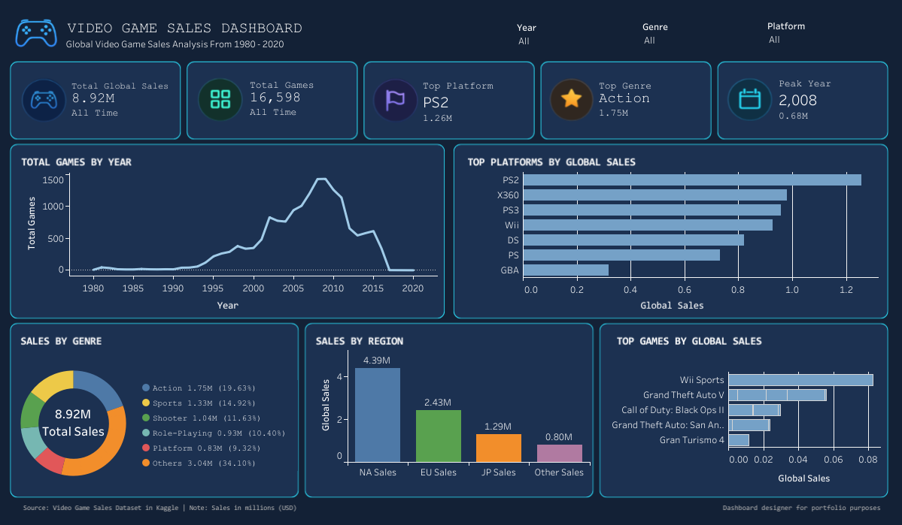

# 🎮 Video Game Sales Analysis

## 📌 Overview

This project analyzes global video game sales data to uncover patterns across **genre, platform, publisher, and region.** The analysis combines **data cleaning, exploratory analysis, statistical testing, and interactive visualization** to generate actionable insights for game developers and publishers. The goal is not only to understand historical trends but also to provide **data-driven recommendations** for future game development and market targeting.

## 📌 Summary

This analysis reveals that the video game industry is highly concentrated, with a small number of publishers dominating global sales. The findings show that **genre preference, platform selection, and regional behavior** significantly influence market performance. Notably, Action games lead global demand, while platform dominance varies across regions, indicating that a **one-size-fits-all strategy is ineffective.** These insights highlight the importance of **targeted, data-driven game development and market-specific strategies** to maximize commercial success.

---

## 🔄 Data Processing
* Handled missing values in Year and Publisher columns
* Removed incomplete records to ensure data quality
* Converted data types for accurate analysis
* Validated dataset consistency (no duplicate data found)

---

## 📊 Exploratory Data Analysis
* Analyzed sales distribution across genre, platform, and region
* Identified top-performing publishers and categories
* Explored trends in game releases over time
* Compared sales patterns across different regions

---

## 🎯 Key Insights

* 🎮 Action is the best-selling genre globally
* 🏆 Nintendo dominates the market significantly
* 🌍 Each region has different platform preferences
* 📊 Platform choice significantly impacts sales (statistically proven)

---

## 📊 Dashboard

🔗 Tableau Dashboard: [here](https://public.tableau.com/app/profile/nabilah.putri.intaka1611/viz/VideoGameSalesDashboard_17376436610220/Dashboard?publish=yes)

  

This dashboard provides an interactive overview of global video game sales from 1980 to 2020, highlighting key trends across platforms, genres, and regions.
Users can explore top-performing games, leading platforms, and sales distribution to understand market dynamics and identify patterns in the gaming industry.

---

## 🛠️ Tools

* Python (Pandas, NumPy)
* Matplotlib & Seaborn
* SciPy
* Tableau

---

## 📂 Project Structure

* Data cleaning & analysis → Jupyter Notebook
* Visualization → Python & Tableau
* Insights → Business recommendations

---

## 🚀 Business Impact

This analysis helps:

* Identify high-performing game genres
* Choose optimal platforms per region
* Improve market targeting strategies

---

## ⚠️ Limitations

* The dataset only includes games with sales above 100,000 copies, which may exclude smaller or indie games
* Data may not reflect recent trends in digital distribution and modern gaming platforms
* Limited variables (no user behavior, marketing spend, or player demographics)
* Analysis is based on historical data, not predictive modeling

---

## 🚀 Future Work

* Develop predictive models to forecast game sales
* Perform deeper analysis on genre-platform combinations
* Integrate additional datasets (e.g., user reviews, ratings, or playtime data)
* Analyze trends in modern platforms such as mobile and digital distribution

---
## 📎 Dataset

Source: Kaggle - Video Game Sales Dataset[here](https://www.kaggle.com/datasets/gregorut/videogamesales)
